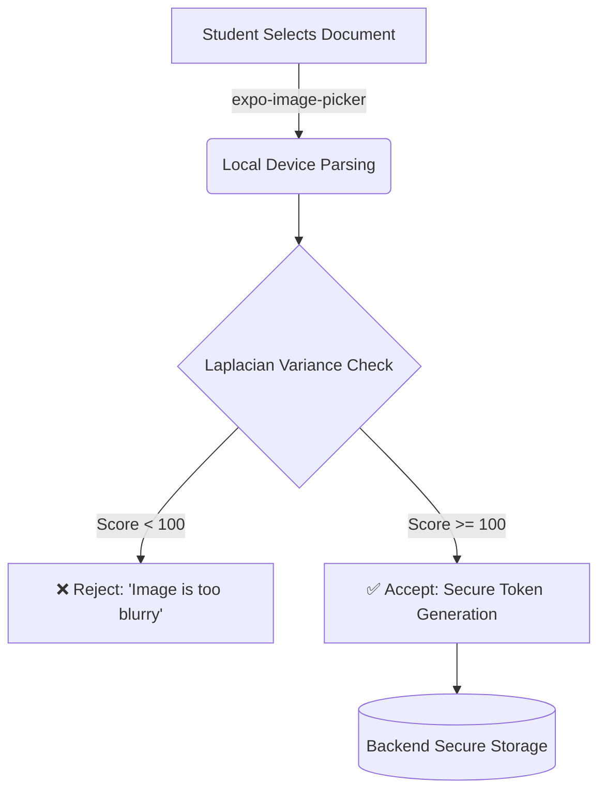

# MedSIS App - Medical Student Information System 

<!-- Version Badges -->
<div align="center" style="margin-bottom: 30px;">
  
  
  
  
  
  
  
  
  
</div>

<!-- Project Images -->
<div align="center" style="display: flex; justify-content: center; align-items: center; gap: 15px; margin: 30px 0 40px 0;">
  
  
  
  
  
</div>

A comprehensive mobile application designed specifically for medical students to upload academic requirements, view evaluation results history, and manage their educational journey. This first version release focuses on streamlined document submission, evaluation tracking, and essential academic tools with AI assistance and real-time communication features.

### 🧠 ML-Powered Image Quality Validation
MedSIS features an intelligent validation pipeline that utilizes Laplacian variance parsing to guarantee the legibility of academic records.



## 📱 Download APK

**Ready to install?** Download the latest APK build:

<div align="center">
  <a href="https://drive.google.com/drive/folders/1DARepPLB5fiFQW9WmEsbbW44oSkSkGMp" target="_blank">
    
  </a>
</div>

> **Note:** Download the APK file from Google Drive and install on your Android device. Make sure to enable "Install from unknown sources" in your device settings.

## 🏥 Release v1.0.0

**Release Date:** December 5, 2025

### Streamlined Academic Management for Medical Students

MedSIS App v1.0.0  delivers a comprehensive mobile solution specifically designed for medical students to efficiently manage their academic requirements and evaluations. This release focuses on core functionalities including secure document upload for academic requirements, real-time evaluation results tracking with e-signatures, AI-powered academic assistance, and seamless communication with faculty.  

**Key Highlights:**

- 🔐 Enhanced security with OTP verification and password requirements
- 📱 Cross-platform compatibility (iOS/Android) with native performance
- 🤖 AI-powered student assistant for academic support
- 💬 Real-time messaging system with live updates
- 📊 Comprehensive evaluation tracking with e-signatures
- 🌙 Dark/Light theme support with NativeWind styling
- ⚡ 100% test coverage ensuring reliability and stability

## Project Structure

```
MedSIS-App/
├── app/                          # Main application screens (file-based routing)
│   ├── (tabs)/                   # Tab-based navigation screens ( Bottom Tabs)
│   │   ├── _layout.tsx          # Tab layout configuration
│   │   ├── ai-assistant.tsx     # AI chatbot interface
│   │   ├── evaluations.tsx      # Student evaluations
│   │   ├── folder.tsx           # File management system
│   │   ├── home.tsx             # Dashboard/home screen
│   │   └── profile.tsx          # User profile management
│   ├── auth/                    # Main Authentication screens
│   │   ├── login.tsx            # Login interface container
│   │   ├── otp-verification.tsx # OTP wrapper
│   │   └── policy-acceptance.tsx# Policy wrapper
│   ├── chat/                    # Chat and messaging screens
│   ├── chat-info/               # Chat information screens
│   ├── notifications/           # Notification screens
│   ├── screens/                 # Additional app screens
│   ├── _layout.tsx              # Root layout configuration
│   └── +not-found.tsx           # 404 error page
├── assets/                      # Static assets
│   ├── fonts/                   # Custom fonts (Montserrat, SpaceMono)
│   ├── images/                  # App images and icons (including swu-head.png)
│   ├── sounds/                  # Notification sounds
│   └── styles/                  # Global styles and layouts
├── components/                  # Modular Component Architecture
│   ├── ai-assistant/            # Isolated AI layout and items
│   ├── auth/                    # Modals, forms & logic for login/otp/reset
│   ├── chat/                    # Messaging blocks & input areas
│   ├── evaluations/             # Modular evaluation wrappers & grade uploads
│   ├── folder/                  # Extracted requirement UI & states
│   ├── home/                    # Component break-down for dashboard screen
│   ├── profile/                 # Separated fields and user actions for profiles
│   ├── ui/                      # Platform-specific UI components
│   │   ├── IconSymbol.tsx       # Icon symbol components
│   │   ├── RotatingDots.tsx     # Loading animations
│   │   └── TabBarBackground.tsx # Tab bar styling
│   ├── Avatar.tsx               # User profile picture component
│   ├── Card.tsx                 # Reusable card layout component
│   ├── Input.tsx                # Form input components
│   └── SplashScreen.tsx         # App loading screen
├── constants/                   # App constants and configuration
│   ├── Colors.ts                # Color definitions and themes
│   └── Config.ts                # Centralized API configuration
├── contexts/                    # React contexts
│   ├── AuthContext.tsx          # Authentication state with live data fetching
│   └── ThemeContext.tsx         # Theme management and dark/light mode
├── hooks/                       # Custom React hooks
│   ├── useColorScheme.ts        # Theme management
│   └── useThemeColor.ts         # Color theme utilities
├── lib/                         # Utility functions
│   └── utils.ts                 # Common utility functions
├── services/                    # External services
│   ├── messageService.ts        # Real-time messaging and chat functionality
│   └── notificationService.ts   # Push notification handling
├── tests/                       # Comprehensive test suite
│   ├── auth/                    # Authentication tests
│   ├── screens/                 # Screen component tests
│   ├── services/                # Service layer tests
│   ├── components/              # UI component tests
│   ├── utils/                   # Utility function tests
│   └── test-runner.js          # Test execution and reporting
├── scripts/                     # Build and utility scripts
│   └── reset-project.js         # Project reset utilities
├── android/                     # Android-specific configuration
│   ├── app/                     # Android app configuration
│   └── gradle/                  # Gradle build system
├── .expo/                       # Expo development files
├── Configuration files          # Package.json, tsconfig, etc.
├── global.css                   # Global CSS styles
├── tailwind.config.js           # Tailwind CSS configuration
└── nativewind-env.d.ts          # NativeWind type definitions
```

## Key Files Explained

### Core Application

- **app/\_layout.tsx** - Root layout with navigation setup and authentication checks
- **app/(tabs)/\_layout.tsx** - Tab navigation configuration with custom styling
- **contexts/AuthContext.tsx** - Global authentication state and user session management

### Main Features

- **app/(tabs)/home.tsx** - Dashboard with announcements, quick actions, and academic overview
- **app/(tabs)/profile.tsx** - User profile with editable personal and academic information
- **app/(tabs)/ai-assistant.tsx** - AI-powered chatbot for student assistance
- **app/(tabs)/folder.tsx** - Document management and file organization system
- **app/(tabs)/evaluation.tsx** - Evaluation Display with evaluator e-signatures

### Authentication Flow

- **app/auth/login.tsx** - Student login with ID and password
- **app/auth/otp-verification.tsx** - Two-factor authentication via OTP with enhanced password requirements
- **app/auth/policy-acceptance.tsx** - Comprehensive privacy policy and terms acceptance

### Messaging & Communication

- **app/screens/messages.tsx** - Messages and conversations management with real-time updates
- **app/chat/[id].tsx** - Individual chat conversation screen with message handling
- **app/chat-info/[id].tsx** - Chat details, media sharing, and user information

### Additional Screens

- **app/screens/announcements.tsx** - Detailed view of school announcements with lazy loading and back-to-top navigation
- **app/screens/evaluations.tsx** - View evaluation results history and evaluator e-signatures
- **app/screens/learning-materials.tsx** - Educational resources and materials
- **app/screens/evaluation.tsx** - Detailed view of Evaluated results and evaluator e-signatures
- **app/notifications/index.tsx** - Push notification management with Philippine time conversion and feedback handling

### Modular Component Architecture (NEW!)

The codebase has recently undergone a major refactoring to break down monolithic screens into highly modular, reusable, and easy-to-maintain components:
- **components/auth/** - Self-contained components for complex authentication flows (modals, validation inputs).
- **components/evaluations/** - Sub-components explicitly handling student grade uploads and evaluation displays.
- **components/folder/** - Reusable requirement list items and modular folder structural components.
- **components/profile/**, **components/home/**, **components/chat/** - Dedicated component ecosystems for each major feature area, ensuring the `app/` screen files remain purely compositional.
- **components/ui/** - Core native elements bridging React Native / iOS / Android UI primitives.

## Get Started

1. Install dependencies

   ```bash
   npm install
   ```

2. Start the development server

   ```bash
   npx expo start
   ```

3. Run on device/emulator
   - Press `a` for Android emulator
   - Press `i` for iOS simulator
   - Scan QR code with Expo Go app

## Testing

1. Generate test report

   ```bash
   node tests/test-runner.js
   ```

2. View test files
   ```bash
   # Test files are available in tests/ directory
   # - tests/auth/ - Authentication tests
   # - tests/screens/ - Screen functionality tests
   # - tests/services/ - API service tests
   ```

**Test Coverage**: 100% (All tests passing)

- ✅ Authentication, Messaging, Chat, Profile, Services
- ✅ UI Components, Validation, Error Handling
- ✅ Edge Cases, Performance Optimization
- ✅ Constants-based configuration testing
- ✅ API integration with centralized config
- ✅ Cross-platform compatibility testing

## Technology Stack

- **Framework**: Expo (React Native)
- **Language**: TypeScript
- **Styling**: NativeWind (Tailwind CSS for React Native)
- **Navigation**: Expo Router (file-based routing)
- **State Management**: React Context API with live data fetching
- **UI Components**: Custom components with Lucide React icons
- **Image Handling**: Expo ImagePicker with fallback system
- **Time Management**: Philippine timezone integration
- **Data Loading**: Lazy loading and pagination support
- **Image Analysis**: ML-powered blur detection and quality assessment
- **Configuration**: Centralized API configuration management
- **Testing**: Comprehensive test suite with constants-based configuration

## Features

### Authentication & Security

- 🔐 Enhanced OTP verification with strengthened password requirements
- 🔑 Password validation including uppercase, numbers, special characters, and length requirements
- 📋 Comprehensive privacy policy acceptance with detailed terms
- 🛡️ Secure session management with live data fetching

### User Experience

- 👤 Advanced profile management with live avatar fetching and SWU head fallback
- 📅 Accurate calendar system with Philippine timezone support
- 🔔 Smart notifications with feedback separation and time conversion
### Document Management & Quality Control

- 🖼️ **Image Blur Analysis** - ML-powered quality check before upload
  - Laplacian variance blur detection (threshold: ~100)
  - Quality scoring system (0-100%)
  - Auto-validation with visual progress indicators
  - Prevents upload of blurry documents
- 📁 Enhanced document management with image viewer improvements
- 📢 Announcements with lazy loading (10 items per batch) and back-to-top navigation

### Core Functionality

- 🤖 AI-powered student assistant
- 💬 Real-time messaging and chat system with live updates
- 📊 View evaluation results history with evaluator e-signatures
- 📚 Learning materials access and download
- ⏰ Real-time calendar events with proper time alignment
- 🖼️ Image viewing without loading delays
- 🔄 Pull-to-refresh functionality across screens
- ⚙️ Centralized configuration management
- 🌙 Dark/Light theme support
- 📱 Cross-platform compatibility (iOS/Android)

## Version 1.0.0

### Core Features

- ✅ ML-powered image blur analysis for document quality control
- ✅ Student requirement upload system with document management
- ✅ View evaluation results history and evaluator e-signatures
- ✅ Secure authentication with OTP verification
- ✅ Real-time messaging and communication system
- ✅ AI-powered student assistant for academic support
- ✅ Philippine timezone integration for accurate scheduling
- ✅ Dark/Light theme support
- ✅ Comprehensive privacy policy and terms acceptance
- ✅ Academic calendar with events and deadlines
- ✅ Grade tracking and performance analytics
- ✅ Push notification system with feedback handling
- ✅ File management and document organization
- ✅ Profile management with avatar system
- ✅ Centralized API configuration management
- ✅ Cross-platform compatibility (iOS/Android)
- ✅ Comprehensive test suite with 100% coverage
- ✅ NativeWind styling for consistent UI/UX
- ✅ TypeScript implementation for type safety

# MSIS - Medical Student Information System 📱
